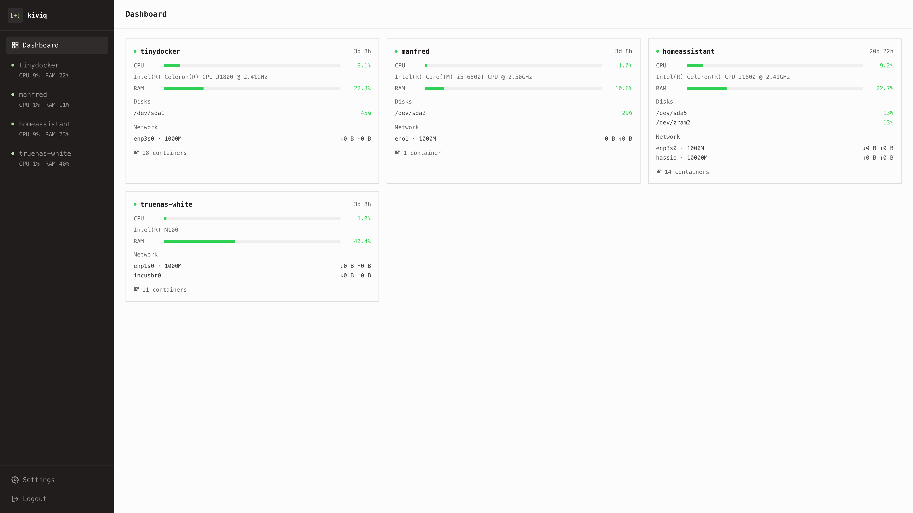
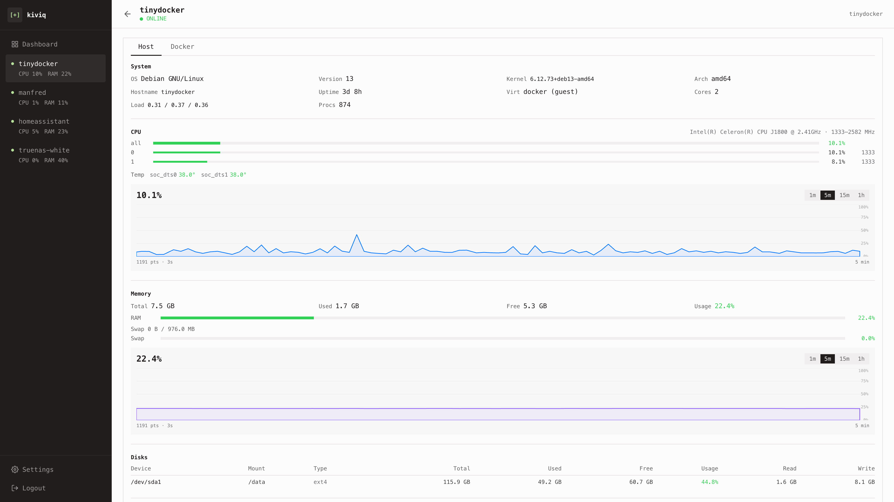
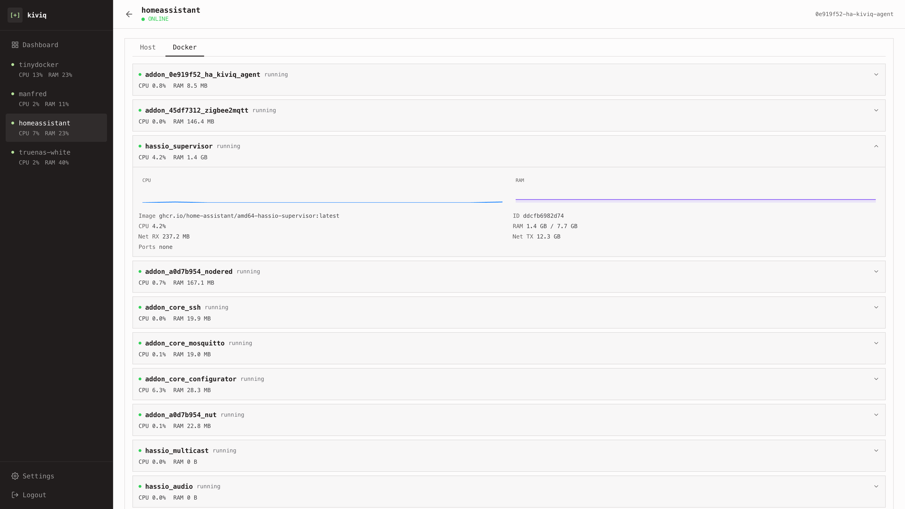

# kiviq-monitor

A lightweight, self-hosted server monitoring system. A central **monitor** collects
metrics from one or more **agents** and serves a live **Vue dashboard** over HTTPS.

## Screenshots

Every monitored host at a glance:



Per-host detail — system info, CPU, memory and disks:



Per-host Docker containers with live stats:



## Architecture

```
┌─────────┐   stats over HTTPS     ┌───────────┐   HTTPS + WebSocket   ┌─────────┐
│  agent  │ ─────────────────────▶ │  monitor  │ ◀──────────────────── │ browser │
│  (Go)   │   POST /api/v1/report  │ (Go +SPA) │   dashboard + live    │  (Vue)  │
└─────────┘   Bearer token         └───────────┘   updates             └─────────┘
   ...                              config.json
 many agents
```

- **`cmd/monitor`** — HTTPS API server (port 9753). Authenticates agent reports, keeps
  the latest snapshot plus rolling history per agent in memory, pushes live updates to
  browsers over WebSocket, and serves the built Vue SPA. Mints a self-signed TLS cert on
  first run and exposes its CA at `/api/v1/ca`.
- **`cmd/agent`** — Runs on each monitored host. Fetches and pins the monitor's CA, then
  every `REPORT_INTERVAL` seconds collects metrics and POSTs them to the monitor with a
  bearer token.
- **`web/`** — Vue 3 + Vite single-page dashboard, built and served by the monitor.

### Metrics collected

CPU (overall, per-core, model, frequency, temperatures), memory and swap, disks
(usage and I/O), network interfaces (throughput, packets, errors), Docker containers
(state, CPU, memory, network), GPU, and host info (OS, kernel, arch, load averages,
uptime, process count) — via [gopsutil](https://github.com/shirou/gopsutil) and the
Docker API.

## Quick start

Prebuilt images are published to GitHub Container Registry:

- `ghcr.io/kiwiprojekt/kiviq-monitor` — the monitor (with the bundled dashboard)
- `ghcr.io/kiwiprojekt/kiviq-agent` — the agent

Drop this `docker-compose.yml` next to nothing else and run `docker compose up -d`. It
starts the monitor and one local agent, seeding it so the agent
authenticates on first boot. The dashboard is then at **https://localhost:9753**
(self-signed cert — expect a browser warning).

```yaml
services:
  monitor:
    image: ghcr.io/kiwiprojekt/kiviq-monitor:latest
    ports:
      - "9753:9753"
    environment:
      KIVIQ_CONFIG: /app/data/config.json
      KIVIQ_MONITOR_USER: admin
      KIVIQ_MONITOR_PASSWORD: changeme        # change this
      KIVIQ_SEED_AGENT_NAME: kiviq-local
      KIVIQ_SEED_AGENT_TOKEN: kiviq-agent-token   # change this
    volumes:
      - kiviq-data:/app/data
    restart: unless-stopped

  agent:
    image: ghcr.io/kiwiprojekt/kiviq-agent:latest
    network_mode: host                         # so the agent sees host metrics
    environment:
      MONITOR_URL: https://localhost:9753
      AGENT_TOKEN: kiviq-agent-token           # identifies this agent — must match an agent token
      AGENT_CA_DIR: /data
      REPORT_INTERVAL: "1"
    volumes:
      - agent-ca:/data
      - /etc/os-release:/host/etc/os-release:ro
      - /var/run/docker.sock:/var/run/docker.sock   # to read container stats
    restart: unless-stopped

volumes:
  kiviq-data:
  agent-ca:
```

> The defaults (`admin` / `changeme`, `kiviq-agent-token`) are placeholders — change
> them before any real use.

## Platforms & supported hosts

Images are published as multi-arch manifests for **`linux/amd64`** and
**`linux/arm64`**, so Docker pulls the matching variant automatically (x86-64 servers,
Apple Silicon, Raspberry Pi / ARM SBCs, etc.).

The two components have very different host requirements:

### Monitor — runs anywhere Docker runs

The monitor is a self-contained HTTPS service. It has no host dependencies, so it runs
the same on a Linux server, Docker Desktop for **macOS**, or Docker Desktop for
**Windows**. On Apple Silicon it runs natively via the `arm64` image. It needs no
access to the Docker socket — only the agent does.

### Agent — designed for **Linux hosts**

The agent reads host-level Linux interfaces (`/proc`, `/sys`, thermal sensors, the
mounted `/etc/os-release`) and relies on `network_mode: host`, so it is meaningful only
on a Linux host you want to monitor. Run one agent per Linux machine.

> **macOS / Windows caveat:** the agent will *start* under Docker Desktop, but it cannot
> see the real Mac/Windows host — a Docker Desktop container lives inside Docker's own
> Linux VM. So it would report the VM's metrics (not your machine), the `/etc/os-release`
> mount has no host file to bind, and `network_mode: host` does not map to the real host.
> Monitoring a macOS/Windows machine itself is out of scope for this agent. You can still
> run the **monitor** on those platforms to watch your Linux hosts.

### Deployment shapes

- **All-in-one (shown above):** monitor + a co-located agent via Compose. The agent
  reaches the monitor at `https://localhost:9753`.
- **Central monitor + remote agents:** run the monitor once, then deploy an agent on
  each Linux host with `MONITOR_URL` pointing at the monitor's address. Register each
  host (or seed one) and give every agent its token. The Admin UI's "provision"
  action generates a ready-to-paste `docker run` / Compose snippet per host.

## Configuration

State lives in `config.json` (path set by `KIVIQ_CONFIG`). It holds the monitor
credentials (bcrypt-hashed) and the registered agents with their tokens, and is
written back when changed via the admin API. It is gitignored because it contains
secrets. On a fresh volume the monitor bootstraps it from the environment.

### Monitor environment variables

| Variable | Default | Purpose |
| --- | --- | --- |
| `KIVIQ_CONFIG` | `config.json` | Path to the config file. TLS cert/key are stored alongside it. |
| `KIVIQ_MONITOR_USER` | `admin` | Dashboard/admin username (used only on first bootstrap). |
| `KIVIQ_MONITOR_PASSWORD` | — | Dashboard/admin password (required to bootstrap a fresh config). |
| `KIVIQ_HISTORY_POINTS` | unlimited | Max history points retained per agent. |
| `KIVIQ_SEED_AGENT_NAME` | `default` | Display name for an agent pre-registered on first boot. Its ID is generated and persisted automatically. |
| `KIVIQ_SEED_AGENT_TOKEN` | — | The seeded agent's token. Seeding only happens when no agents exist yet. |

### Agent environment variables

| Variable | Default | Purpose |
| --- | --- | --- |
| `MONITOR_URL` | — | Monitor base URL, e.g. `https://monitor.example:9753` (required). |
| `AGENT_TOKEN` | — | Bearer token (required). It both authenticates the agent **and** identifies which agent it reports as — the monitor derives the agent ID and name from the matching token, so the agent never declares its own identity. |
| `REPORT_INTERVAL` | `1` | Seconds between reports. |
| `AGENT_CA_DIR` | `/data` | Where the fetched monitor CA is cached. |

## HTTP API

| Method & path | Auth | Description |
| --- | --- | --- |
| `POST /api/v1/report` | per-agent bearer token | Agent submits a metrics report. |
| `GET /api/v1/agents` | basic auth | List agents with their latest snapshot. |
| `GET /api/v1/agents/{id}` | basic auth | Latest snapshot for one agent. |
| `GET /api/v1/agents/{id}/history` | basic auth | Rolling metric history. |
| `GET /api/v1/admin/agents` | basic auth | List configured agents. |
| `PUT /api/v1/admin/agents` | basic auth | Replace the agent list. |
| `GET /api/v1/admin/provision/{id}` | basic auth | Provisioning details for an agent. |
| `POST /api/v1/admin/password` | basic auth | Change monitor credentials. |
| `GET /ws` | query-param auth | WebSocket stream of live updates. |
| `GET /api/v1/ca` | public | Monitor CA certificate (PEM). |
| `GET /health` | public | Liveness check. |

## Home Assistant Add-ons

Kiviq Monitor runs in Home Assistant (HAOS / Supervised) as a custom add-on. The add-ons —
**Kiviq Monitor** (central server + dashboard) and **Kiviq Agent** (reports the HA host's
metrics) — live in a separate repository with their own installation and configuration docs:

➡️ **[kiwiprojekt/ha-apps](https://github.com/kiwiprojekt/ha-apps)**

[](https://my.home-assistant.io/redirect/supervisor_add_addon_repository/?repository_url=https%3A%2F%2Fgithub.com%2Fkiwiprojekt%2Fha-apps)

## Development

Requirements: Go 1.26+ and Node 20+.

```bash
# Backend
go test ./...
go run ./cmd/monitor        # serves config.json-based monitor locally
go run ./cmd/agent         # needs MONITOR_URL and AGENT_TOKEN set

# Frontend (web/)
npm install
npm run dev                # Vite dev server
npm run test               # Vitest
npm run lint
npm run build              # output to web/dist, served by the monitor
```

## License

[MIT](LICENSE)
